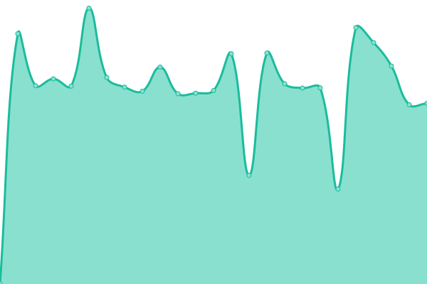

# [📈 Live Status](https://Thibault-R.github.io/uptime): <!--live status--> **🟧 Panne partielle**

This repository contains the open-source uptime monitor and status page for [Thibault](https://Thibault-R.github.io/uptime), powered by [Upptime](https://github.com/upptime/upptime).

With [Upptime](https://upptime.js.org), you can get your own unlimited and free uptime monitor and status page, powered entirely by a GitHub repository. We use [Issues](https://github.com/Thibault-R/uptime/issues) as incident reports, [Actions](https://github.com/Thibault-R/uptime/actions) as uptime monitors, and [Pages](https://Thibault-R.github.io/uptime) for the status page.

<!--start: status pages-->
<!-- This summary is generated by Upptime (https://github.com/upptime/upptime) -->
<!-- Do not edit this manually, your changes will be overwritten -->
<!-- prettier-ignore -->
| URL | Statut | Historique | Délai de réponse | Temps |
| --- | ------ | ------- | ------------- | ------ |
|  [Nord Compo](https://nordcompo.fr/) | 🟥 Hors ligne | [nord-compo.yml](https://github.com/Thibault-R/uptime/commits/HEAD/history/nord-compo.yml) | 

 821ms
     
 | 

<a href="https://Thibault-R.github.io/uptime/history/nord-compo">100.00%</a>
    

|  [NordSoft](https://www.nordsoft.fr/) | 🟩 En ligne | [nord-soft.yml](https://github.com/Thibault-R/uptime/commits/HEAD/history/nord-soft.yml) | 

 1006ms
     
 | 

<a href="https://Thibault-R.github.io/uptime/history/nord-soft">100.00%</a>
    

|  [Libeo](https://www.libeo.net/) | 🟩 En ligne | [libeo.yml](https://github.com/Thibault-R/uptime/commits/HEAD/history/libeo.yml) | 

 793ms
     
 | 

<a href="https://Thibault-R.github.io/uptime/history/libeo">100.00%</a>
    

|  [Google](46.28.246.123) | 🟩 En ligne | [google.yml](https://github.com/Thibault-R/uptime/commits/HEAD/history/google.yml) | 

 59ms
     
 | 

<a href="https://Thibault-R.github.io/uptime/history/google">100.00%</a>
    

|  [Comité France Chine](http://cfc.libeo.net/) | 🟩 En ligne | [comite-france-chine.yml](https://github.com/Thibault-R/uptime/commits/HEAD/history/comite-france-chine.yml) | 

 1111ms
     
 | 

<a href="https://Thibault-R.github.io/uptime/history/comite-france-chine">100.00%</a>
    

|  [ClicEdit - Dév](http://clicedit.libeo.net/) | 🟩 En ligne | [clic-edit-dev.yml](https://github.com/Thibault-R/uptime/commits/HEAD/history/clic-edit-dev.yml) | 

 1240ms
     
 | 

<a href="https://Thibault-R.github.io/uptime/history/clic-edit-dev">100.00%</a>
    

|  [ClicEdit - Prod](http://www.clicedit.com/) | 🟩 En ligne | [clic-edit-prod.yml](https://github.com/Thibault-R/uptime/commits/HEAD/history/clic-edit-prod.yml) | 

 2114ms
     
 | 

<a href="https://Thibault-R.github.io/uptime/history/clic-edit-prod">100.00%</a>
    

<!--end: status pages-->

[**Visit our status website →**](https://Thibault-R.github.io/uptime)

## 📄 License

- Powered by: [Upptime](https://github.com/upptime/upptime)
- Code: [MIT](./LICENSE) © [Thibault](https://Thibault-R.github.io/uptime)
- Data in the `./history` directory: [Open Database License](https://opendatacommons.org/licenses/odbl/1-0/)
